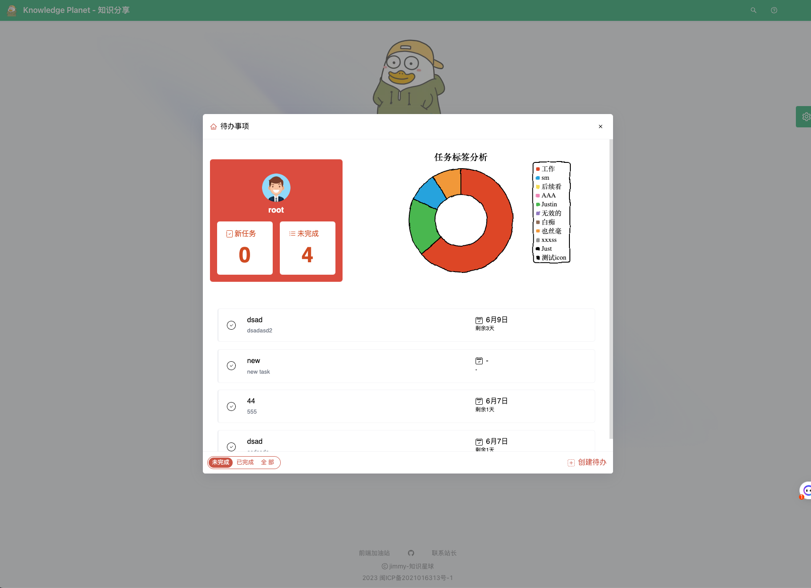

# todo list

> 这是一个 [Plasmo 扩展插件](https://docs.plasmo.com/) 项目,使用 [`plasmo init`](https://www.npmjs.com/package/plasmo) 脚手架生成。

本项目是为了`Jimmy`的新项目创建的 Chrome 浏览器插件：

[Jimmylxue/snow-todolist: ✨ 新项目 - todolist 基于monorepo架构下 react + nest.js 全栈项目，麻雀虽小五脏俱全。在线访问：https://tdl.jimmyxuexue.top](https://github.com/Jimmylxue/snow-todolist)

## 预览

使用以下组合键即可在任何页面唤起此插件:

- `command`+`.`
- `ctrl`+`j`

### 登录


### 应用



## 开始

首先,运行开发服务器:

```
copy codepnpm dev
# 或
npm run dev
```

打开浏览器访问相应的开发版本。例如,如果你正在为 Chrome 浏览器开发基于manifest v3 的插件,使用:`build/chrome-mv3-dev`。

你可以修改 `popup.tsx` 来编辑弹出窗口。代码修改后会自动更新。要添加选项页面,只需在项目根目录添加 `options.tsx` 文件,默认导出一个 React 组件即可。同样地,要添加内容页,只需在项目根目录添加 `content.ts` 文件,导入一些模块并进行一些逻辑,然后重新加载扩展。

如需详细指南,[参考我们的文档](https://docs.plasmo.com/)。

## 打包发布版本

运行:

```
copy codepnpm build 
# 或 
npm run build
```

这会生成你的扩展的生产版本,准备好打包和发布到商店。


## 提交到商店

使用内置的 [bpp](https://bpp.browser.market/) Github 动作部署 Plasmo 扩展非常方便。在使用此操作之前,请首先构建你的扩展并上传第一版到商店以建立基本凭据。然后,只需遵循[此设置说明](https://docs.plasmo.com/framework/workflows/submit),你就可以启动自动提交!
